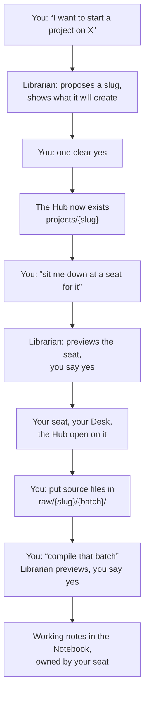

# Starting a New Project

> How to begin a long-running subject in the Library, from the chair you actually sit in: you ask,
> the Librarian shows you what it is about to do, and you say yes. Written for a project you expect
> to return to for months, not a one-afternoon question.
>
> **You will not type a command anywhere in this guide.** Everything here happens in conversation,
> except one step where you put your own files in a folder.

A short answer first: **a Project Hub and a seat are different things, and they are made in a fixed
order.** The Hub is the shared, durable record of the work — what the project is, what is open, what
was decided. The seat is your place to work on it: your own Desk, your own Notebook topics. The two
bind to each other permanently, so the Hub has to exist before the seat can point at it.

Both are made by asking. The Librarian previews each one, and neither happens without your yes.



## One name, used everywhere

Pick **one lowercase slug** for the project and it is reused for everything: the Hub is
`projects/<slug>`, your source material goes under `raw/<slug>/<source-batch>/`, anything made for
you lands in `output/<slug>/`, and working notes in `notebook/<slug>/`.

Lowercase letters, digits and single hyphens. The Librarian will propose one from what you describe
— read it before you approve, because **the slug is permanent** and four different places will wear
it for the life of the project.

## Step 1 — ask for the Project Hub

Tell the Librarian what the project is, in a sentence or two. Not a topic word — what you are
actually trying to do:

> "I want to start a project on the Fallout 4 settlement mods I'm collecting — what works together
> and what conflicts."

It will check whether a Hub already exists for that subject and tell you if it does. If not, it
shows you a preflight: the slug, the title, the purpose it is about to write, and exactly what gets
created. Nothing is written yet.

**What to look at before you say yes.** The slug, because it is permanent. The purpose sentence,
because it is what orients you in three months. If either is wrong, say so — it re-previews, and
nothing has happened yet.

Say **yes**, and the Hub exists.

**If it is development work** — a code project with a repository — say so. The Hub gets two extra
sections, one for the working tree, remote, branch and the command that proves a change is done, and
one for settled decisions. The Librarian seeds those with instructions rather than guesses, and you
fill them in together.

**This step works from a session with no seat at all**, which is the usual case for a brand-new
project. You do not need to be sitting anywhere to create the Hub.

## Step 2 — take a seat

A seat is a named place to work, carrying its own Desk. **There is no default one.** A session that
has no seat can read the Library's own files and answer from them, and that is all — it cannot open
a Book, compile anything, or change anything.

So ask to sit down:

> "Create a seat for that project and sit me down at it."

You will see a preflight and give one yes, exactly like the Hub. What you get afterwards is a seat
bound to this conversation, its Desk, and the Project Hub already open on it.

**Three things worth knowing before you approve:**

- **The binding is permanent, in both directions.** One seat works on one Project, and one Project
  has at most one seat. Nothing rebinds either side. Working on three subjects at once means three
  seats — which is normal and cheap, not a workaround.
- **The Hub must already be active**, which is why step 1 comes first. Seat creation checks the
  Project catalog and refuses otherwise.
- **The seat's name does not have to match the slug**, and life is easier when it does.

**If a session ever starts without a seat, it will tell you and ask.** It lists the seats that
exist, which are free, and which one this conversation last sat at. Answer with the one you want.
A conversation you resume is put back where it was automatically, without asking, as long as nobody
else is sitting there.

**There is also a Library Seat button** in the tab bar, which opens a seat picker: one numbered entry
per seat showing its Project, whether anyone is at it, and what it was last doing — a row on a wide
terminal, a card per seat on a narrow one. A number sits you
down; `q` leaves; and `+` creates a seat — **including its Project Hub, if the project does not exist
yet.** Type a slug nothing uses and it offers to create the Hub, asks for a title and a sentence on
what the project is for, shows you what it would write, and makes the Hub and the seat in one pass.

So either route does the whole job. Use whichever you are already looking at.

## Step 3 — what is on your Desk

Ask **"what's on my desk?"** whenever you want your bearings. You will get your seat, what is open
on it, your Notebook's shape, and anything waiting on the Holding Shelf.

A new seat opens its own Project Hub and nothing else. If you want a reference Book alongside it,
ask for it by name — "open the basic-memory Book" — and it goes on your Desk too. A Book that is
**closed is unavailable**, whether it lives on the network or on this machine; the Librarian will
say so and offer to open it rather than reading around the edge.

## Step 4 — put your source material in

**This is the one step that is yours to do by hand.** Source material goes in:

```
raw/<slug>/<source-batch>/
```

One folder per coherent import — a set of manuals, a documentation export, one site's pages. Give
the batch a short name that says where the material came from and roughly when. Drag the files in
however you like.

Then tell the Librarian the batch is there, and it records who owns it and why, so that a later
inventory knows the material is still in use rather than debris.

**If the material lives at a web address or in a git repository, do not fetch it yourself** — ask.
The Librarian can turn a URL into a proper raw batch and record the exact commit or content it
hashed, so months later it can answer whether your material has fallen behind its source. Files you
copy in by hand carry no such anchor.

## Step 5 — ask for it to be compiled

> "Compile that batch into the Notebook."

This reads the raw material and writes working notes under `notebook/<slug>/`. You will see a
preflight naming the batch and what it will write, and it waits for your yes.

**It compiles the batch you asked for and nothing else.** Never all of `raw/` — other projects'
material is not swept in behind you.

Compiling is one of the actions that needs your seat's live claim, so it is refused in a session
that is not properly sat down. If that happens, see *When something refuses you* below.

## Step 6 — the notes get an owner

A Notebook topic that no seat owns will **block a reset** later, and that is deliberate: a reset
refuses to guess at material nobody has claimed. So new topics are registered to your seat as part
of creating them, rather than discovered as a problem months later.

The Librarian handles this as part of the compile. You can ask **"who owns my Notebook topics?"** at
any time to see the record. A topic two seats genuinely share can be declared shared, and one that
no reset should ever touch can be declared excluded — say which and it is recorded.

**Both of those declarations are permanent until you change them, and they mean what they say.** A
shared or excluded topic is taken by **no seat's reset, at any width** — so if you later ask for an
empty Notebook, that topic is what will still be sitting there, correctly. That is the point of
declaring it. Undoing the declaration is possible and is its own decision; ask what it was protecting
before you do.

## Coming back to it, weeks later

Open the conversation again and you are put back at the seat it last held. If you start fresh
instead, you will be asked which seat you want.

Then ask for two things:

> "What's on my desk?" — your seat, what is open, what is waiting.
>
> "Brief me on this project." — the Hub's own orientation, its `Now` and `Next`, and the connections
> it recorded.

That is the whole cold start. The Hub holds what the project is and what is open, the seat holds
what you had on the Desk, and the conversation record joins them up.

**Close a session by asking the Librarian to bring the Hub current.** What happened goes to a dated
page in the project's `notes/`, and `Now` and `Next` get edited to match. The Hub's front page stays
orientation and open items — never a session log, which is why the dated page exists.

**Closing a session retires nothing.** The seat, its Desk, its Project and its topics are all still
there next time.

## When something refuses you

Refusals in the Library are written to be read. They name what stopped you and what fixes it, and
they are worth a look before asking again — but pasting one back to the Librarian works too.

Three questions answer almost everything, in this order:

1. **Is there a seat?** A session that never sat down can read the Library's own files and nothing
   else.
2. **Does this session hold the seat's claim?** A session can know which seat it is at and still not
   hold it — in which case opening a Book, compiling and resetting are refused, while editing the
   Project Hub is allowed. That asymmetry is intentional.
3. **Is the Book open at *this* seat?** Desks do not share. Another seat's open Book is not on yours.

Asking **"what's on my desk?"** answers all three at once.

## See also

- [Library Learning Path](learning-path.md) — things to try on something disposable first, each one
  proving a specific piece of how this works.
- [Library Workflow Guide](workflow-guide.md) — the same behaviour drawn as pictures.
- The `library-help` Skill — ask "how do I…", "what happens if I reset?", "where should this go?"
  and you get a direct answer instead of a reconstructed procedure.

*Behind the desk: every step above runs a helper with a preflight and an approval, and those are
specified in [Seats](../seats.md) and
[Librarian Operation Playbooks](../librarian-operation-playbooks.md). Those two are written for
whoever maintains the Library, not for you — you never need them to do the work on this page.*
