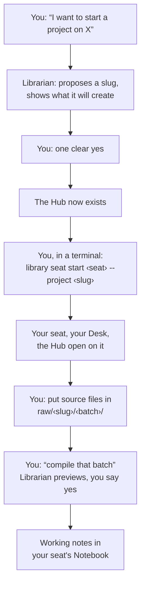

# Starting a New Project

> How to begin a long-running subject in the Library: you ask, the Librarian shows you what it is
> about to do, and you say yes. Written for a project you expect to return to for months, not a
> one-afternoon question.
>
> **You type one command in this guide**, the one that sits you down. You also put your own files in
> a folder by hand. Everything else happens in conversation.

A short answer first: **a Project Hub and a seat are different things, and they are made in a fixed
order.** The Hub is the durable record of the work: what the project is, what is open, what was
decided. The seat is your place to work on it, with your own Desk and your own Notebook. The two
bind to each other permanently, so the Hub has to exist before the seat can point at it.



## One name, used everywhere

Pick **one lowercase slug** for the project and it is reused for everything. Your source material
goes under `raw/<slug>/<source-batch>/`, and anything made for you lands in `output/<slug>/`. The
Hub carries the slug too. In a Library on your own disk it lives in `collection/projects/<slug>`,
and in a shared collection it is `projects/<slug>` there.

Use lowercase letters, digits and single hyphens. The Librarian will propose a slug from what you
describe. Read it before you approve, because **the slug is permanent** and several places will
wear it for the life of the project.

## Step 1: ask for the Project Hub

Tell the Librarian what the project is, in a sentence or two. Not a topic word, but what you are
actually trying to do:

> "I want to start a project on the Fallout 4 settlement mods I'm collecting: what works together
> and what conflicts."

It will check whether a Hub already exists for that subject and tell you if it does. If not, it
shows you a preview: the slug, the title, the purpose it is about to write, and exactly what gets
created. Nothing is written yet.

**What to look at before you say yes.** The slug, because it is permanent. The purpose sentence,
because it is what orients you in three months. If either is wrong, say so. It previews again, and
nothing has happened yet.

Say **yes**, and the Hub exists.

**If it is development work** (a code project with a repository), say so. The Hub gets two extra
sections: one for the working tree, remote, branch and the command that proves a change is done,
and one for settled decisions. The Librarian seeds those with instructions rather than guesses, and
you fill them in together.

**This step works from a session with no seat at all**, which is the usual case for a brand-new
project. You do not need to be sitting anywhere to create the Hub.

## Step 2: take a seat

A seat is a named place to work, carrying its own Desk and its own Notebook. **There is no default
one.** A session that has no seat can read the Library's own files and answer from them, and that
is all. It cannot open a Book, compile anything, or change anything.

So sit down, from a terminal in your Library folder:

```
library seat start fallout --project fallout-settlements
```

That makes the seat, binds it to the Project, opens the Hub on its Desk, and starts your assistant
there. Add `--command codex` for Codex. Next time, `library seat start fallout` is enough.

**Three things worth knowing:**

- **The binding is permanent, in both directions.** One seat works on one Project, and one Project
  has at most one seat. Nothing rebinds either side. Working on three subjects at once means three
  seats, which is normal and cheap, not a workaround.
- **The Hub must already exist and be active**, which is why step 1 comes first. Seat creation
  checks and refuses otherwise.
- **The seat's name does not have to match the slug**, though life is easier when it does.

**A session that starts without a seat tells you so and asks.** In Claude Code you can answer in the
conversation and it binds that seat there. On Windows it also lists the seats that exist and puts a
resumed conversation back at the seat it last held. In Codex, leave and use `library seat start`.

## Step 3: what is on your Desk

Ask **"what's on my desk?"** whenever you want your bearings. You will get your seat, what is open
on it, your Notebook's shape, and anything waiting on the Holding Shelf.

A new seat opens its own Project Hub and nothing else. If you want a reference Book alongside it,
ask for it by name ("open the recipes Book") and it goes on your Desk too. A Book that is **closed is
unavailable**, even when its files are on this machine. The Librarian will say so and offer to open
it rather than reading around the edge.

## Step 4: put your source material in

**This is the one step that is yours to do by hand.** Source material goes in:

```
raw/<slug>/<source-batch>/
```

Use one folder per coherent import: a set of manuals, a documentation export, one site's pages.
Give the batch a short name that says where the material came from and roughly when. Drag the files
in however you like.

Then tell the Librarian the batch is there. It can search that one batch for you, and it never
searches all of `raw/` at once.

**Material from a web address or a git repository** is fetched by hand for now. Download it into a
batch folder yourself. Fetching it with a record of the exact commit, so that the Library can later
tell you whether your copy has fallen behind its source, is not in the `library` program yet.

## Step 5: ask for it to be compiled

> "Compile that batch into the Notebook."

This reads the raw material and writes working notes into your seat's Notebook. You will see a
preview naming the batch and what it will write, and it waits for your yes.

**It compiles the batch you asked for and nothing else.** It never compiles all of `raw/`, so other
projects' material is not swept in behind you.

Compiling needs this session to hold your seat, so it is refused in a session that is not properly
sat down. If that happens, see *When something refuses you* below.

## Step 6: keep what matters somewhere durable

The Notebook is **working** knowledge. A reset sets it aside, all of it, for your seat. So when a
piece of it has settled, move it somewhere a reset cannot reach:

- **"Put this in the *X* Book"** adds it as a page of an open Shelf Book;
- **"Add this to the project"** records it on the Project Hub;
- **"Save this for later"** puts it on the Holding Shelf to sort out another day.

Nothing is ever lost by a reset, since it is quarantined rather than deleted, but moving what matters
first means you never need to go and get it back.

## Coming back to it, weeks later

Run `library seat start fallout` again. Then ask for two things:

> "What's on my desk?": your seat, what is open, what is waiting.
>
> "Brief me on this project.": the Hub's own orientation, its `Now` and `Next`, and the connections
> it recorded.

That is the whole cold start. The Hub holds what the project is and what is open, and the seat holds
what you had on the Desk and in your Notebook.

**Close a session by asking the Librarian to bring the Hub current.** Keep the Hub's front page to
orientation and open items, never a session log. Each change to it is previewed first, like any
other.

**Closing a session retires nothing.** The seat, its Desk, its Notebook and its Project are all
still there next time.

## When something refuses you

Refusals in the Library are written to be read. They name what stopped you and what fixes it. They
are worth a look before asking again, though pasting one back to the Librarian works too.

Three questions answer almost everything, in this order:

1. **Is this session at a seat?** A session that never sat down can read the Library's own files and
   nothing else.
2. **Does this session hold the seat?** Only one session works at a seat at a time. A second one is
   refused, so start another seat.
3. **Is the Book open at *this* seat?** Desks do not share. Another seat's open Book is not on yours.

Asking **"what's on my desk?"** answers all three at once. And `library doctor` checks the
installation itself.

## See also

- [Library Learning Path](learning-path.md): things to try on something disposable first, each one
  proving a specific piece of how this works.
- [Library Workflow Guide](workflow-guide.md): the same behaviour drawn as pictures.
- [Quick Start](quick-start.md): the ten-minute version from a fresh install.

*Behind the desk: every step above runs a command with a preview and an approval, and those are
specified in [Seats](../seats.md) and
[Librarian Operation Playbooks](../librarian-operation-playbooks.md). Those two are written for
whoever maintains the Library, not for you. You never need them to do the work on this page.*
