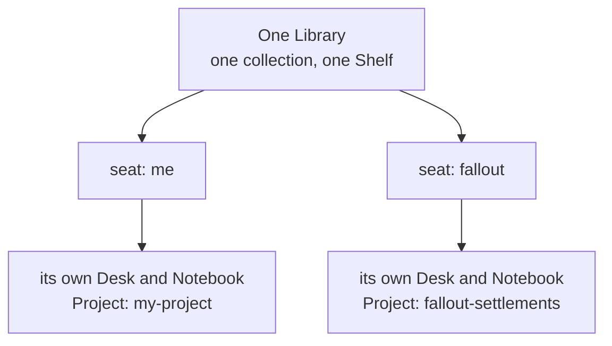
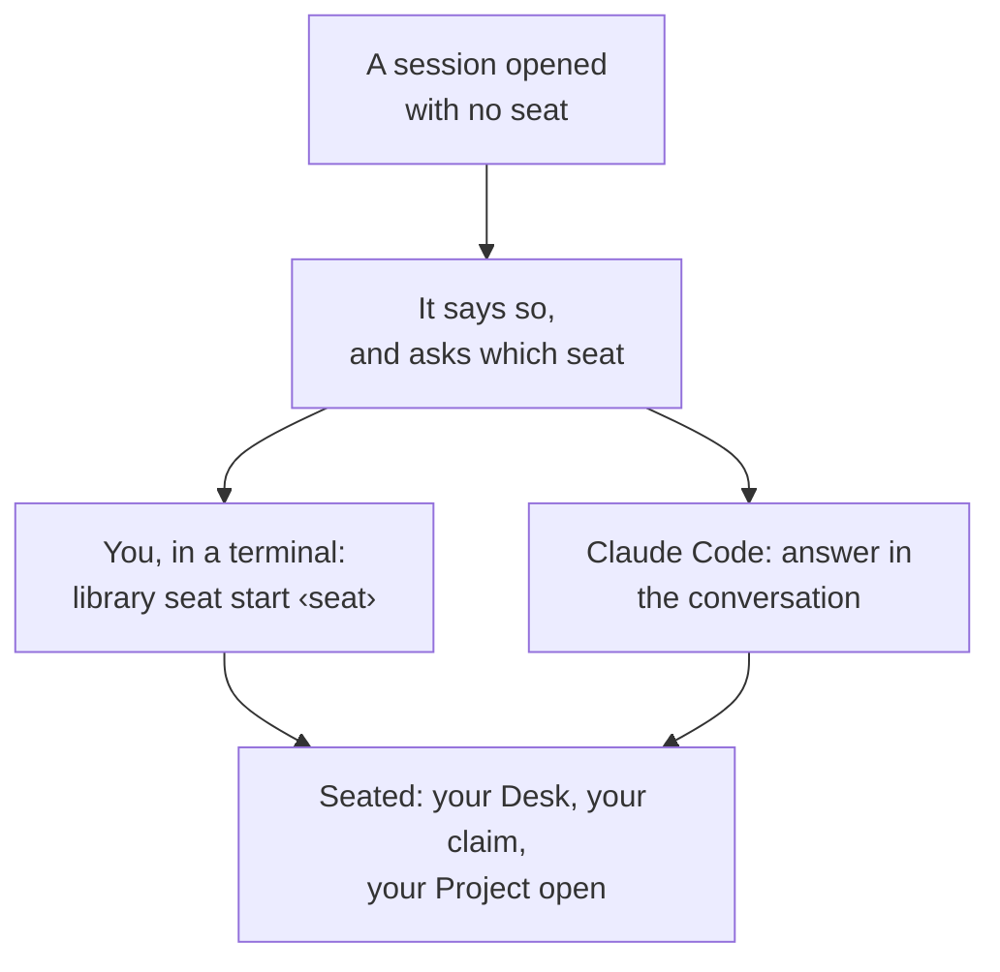
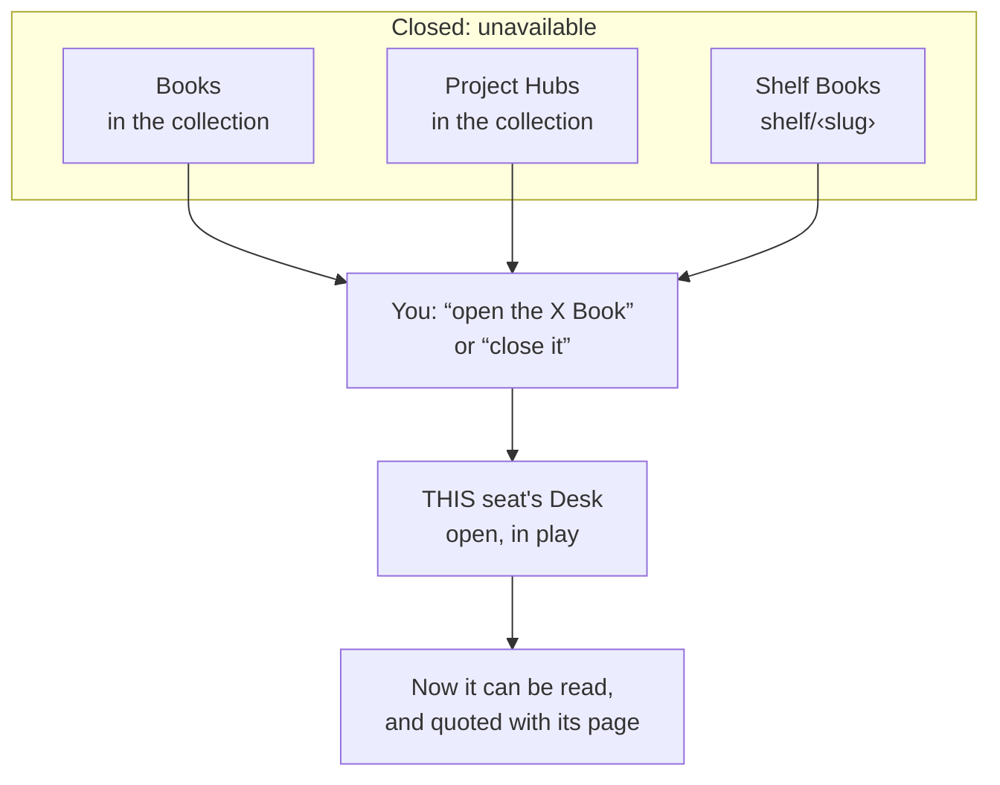
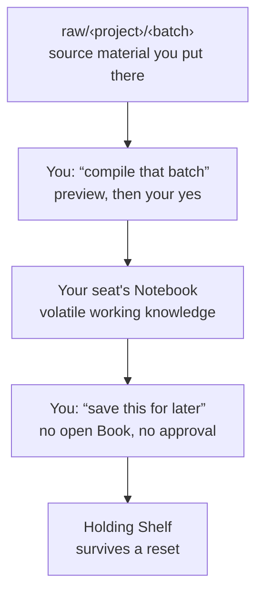
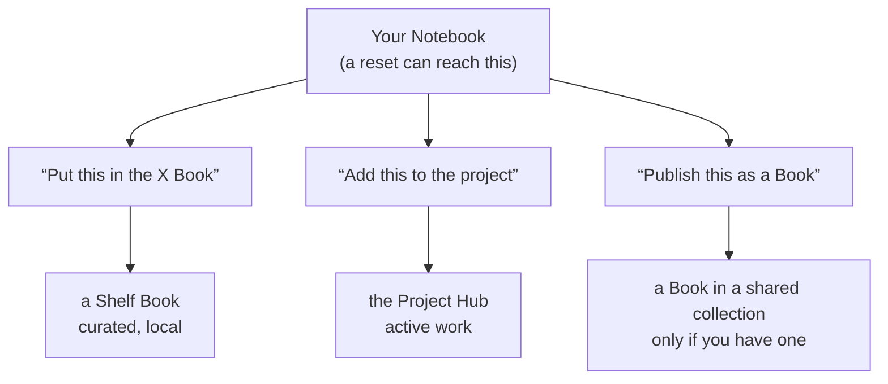
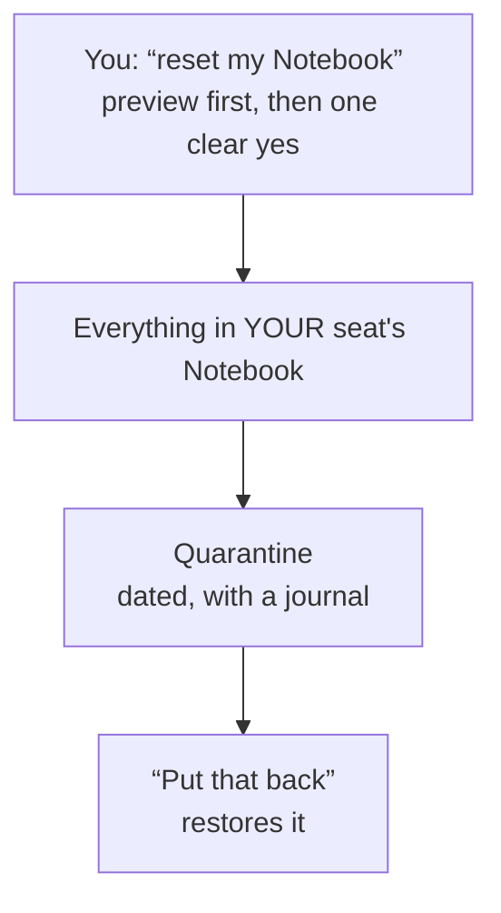
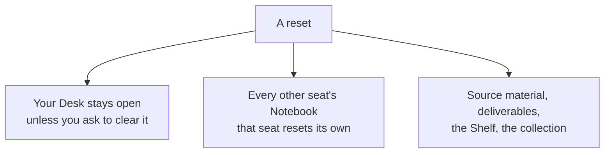
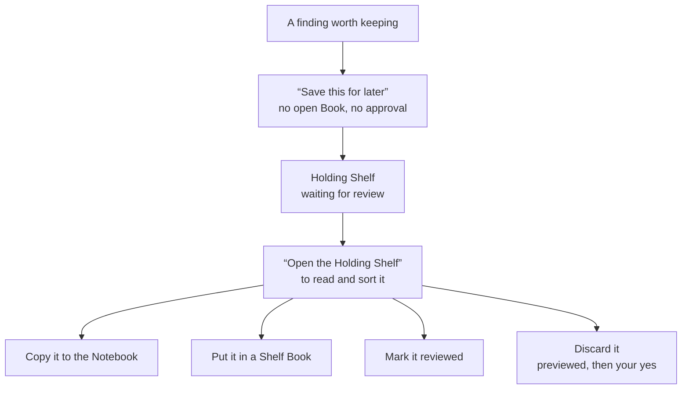
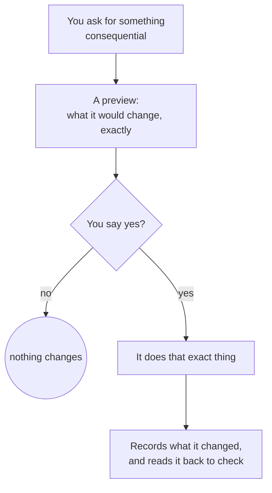

# Library Workflow Guide

A visual companion to the other guides: the same behaviour, drawn as flow rather than prose. Each
diagram answers one question. Boxes are states or places material lives, and arrows are what moves
it. Where that is something **you** do, the box says so in the words you would actually use.

New here? Read the [Quick Start](quick-start.md) first. It is shorter, and it gets you to a seat.

## One Library, one Desk and one Notebook per seat

A Library is one workspace folder. It holds one collection of Books and Project Hubs, which lives on
your own disk unless you choose to share it, and one Shelf of local Books. What multiplies is the
**seat**. Each seat carries its own **Desk** and its own **Notebook**, and each is bound to exactly
one Project. Working three subjects at once means three seats, not three Libraries.

The binding holds in both directions and nothing undoes it. A seat cannot be re-aimed at another
Project, and a Project has at most one seat. Ask for a second seat instead. It costs nothing.

## Sitting down

**There is no default seat.** A session that is not sitting anywhere can read the Library's own
files and nothing else. It cannot open a Book, compile, reset, or change anything. That is a real
state rather than a misconfiguration, because a default would be the seat that stray work silently
joined.

`library seat start` is the way in that works everywhere, for Claude Code and for Codex
(`--command codex`). A seatless Claude Code session can also bind a seat when you answer its
question. On Windows, that session lists the seats that exist, and a resumed conversation is put
back at the seat it last held when nobody else is sitting there.

**One session per seat.** A second session at a seat someone is working at is refused.

## Opening and closing

Books live in the collection or on the local Shelf, and Project Hubs live in the collection. Either
way, "open" and "close" mean the same thing. On the Desk, the Librarian can read it. Off the Desk,
closed means **unavailable**, even though the files sit on this machine.

Opening and closing act on **your** Desk and need your seat. A closed Book is never quietly read
around the edge. The Librarian says it is closed and offers to open it.

## Into the Notebook, and out to somewhere durable

The Notebook is volatile working knowledge, and each seat has its own. **Capture** is the move that
needs no decision and no open Book, and it is deliberately the cheapest path in the Library.

Putting files into `raw/<project>/<batch>/` is the one routine step you do with your own hands.

## Graduating: the durable exits

**Graduating** is moving something somewhere a reset cannot reach. Each exit needs its destination
open on your Desk.

Publishing a Book for other machines needs a **shared collection** (see the README's *Sharing a
collection across machines*). A Library on your own disk keeps its Books on the Shelf, where they are
just as durable.

## What a reset moves, and how it comes back

A reset acts on **your seat's Notebook** and **sets it aside rather than deleting it**. Nothing is
destroyed, and the way back is an ordinary request.

What it leaves alone is as important as what it takes:

**"What survived the reset?"** lists every quarantine, and works even in a session with no seat.

## Capture and triage on the Holding Shelf

"Save this for later" needs no open Book and cannot lose anything, because it only ever adds a
page. Reading or sorting what landed there does need the Book open, like any Shelf Book. A note's
file name carries the date as your own clock reads it.

Copying to the Notebook **copies rather than moves**, so the Shelf record survives the next reset
even after you have worked on the copy. Discarding is previewed and waits for your yes, because it
is the one move here that can lose something.

**The Report Inbox** is the same kind of Book, for a different kind of note: a defect in the Library
itself, filed with the command that failed and what it printed. A report is a claim to check later,
never an order.

## The preview-and-approve pattern

Every consequential action in the Library has the same shape, so you only have to learn it once.
That includes publishing, triage, archiving, resetting, retiring, restoring and discarding.

**Your yes covers that one previewed action and never carries to the next.** If anything changed
between the preview and your approval, the action stops with nothing written and shows you a fresh
preview. That is the guard working, not a glitch. And a preview that finds something it must refuse
does not offer you an approval at all.

## Answering a question, layer by layer

Search says where a term occurs, and never what the material means. Opening what a hit names is
part of answering, not an optional extra.

**An answer that stopped early is never a finding of absence**, and a closed Book is never opened
just to search it. Knowing what a Book is about only earns the suggestion to open it.

## Key Takeaways

- One Library, one collection and one Shelf, with a Desk and a Notebook **per seat**. There is no
  default seat, and a session holding none can read the Library's own files and nothing else.
- `library seat start <seat>` sits you down, in Claude Code or Codex. A seatless session says so
  and asks.
- Open and closed mean the same thing everywhere: on the Desk and readable, or off it and not.
- A reset sets **your seat's Notebook** aside, leaves your Desk open unless you ask otherwise, and
  has a supported way back.
- Saving something for later is free, because it can only add. Everything that could lose something
  previews first and waits for one clear yes.
- Search and discovery say where a term occurs, never what it means. Opening the hit is what
  licenses an answer.
