# Library Workflow Guide

A visual companion to the other guides: the same behaviour, drawn as flow rather than prose. Each
diagram answers one question. Boxes are states or places material lives; arrows are what moves it —
and where that is something **you** do, the box says so in the words you would actually use.

Coming back from the pre-seat Library? Read
[Returning Reader Quick Start](quick-start-returning-reader.md) first — it is shorter and it names
what changed.

## One Library, many Desks

There is one checkout, one shared collection, one Shelf and one Notebook. What multiplies is the
**Desk**: each seat carries its own, and each seat is bound to exactly one Project. Working three
subjects at once means three seats, not three copies of the Library.

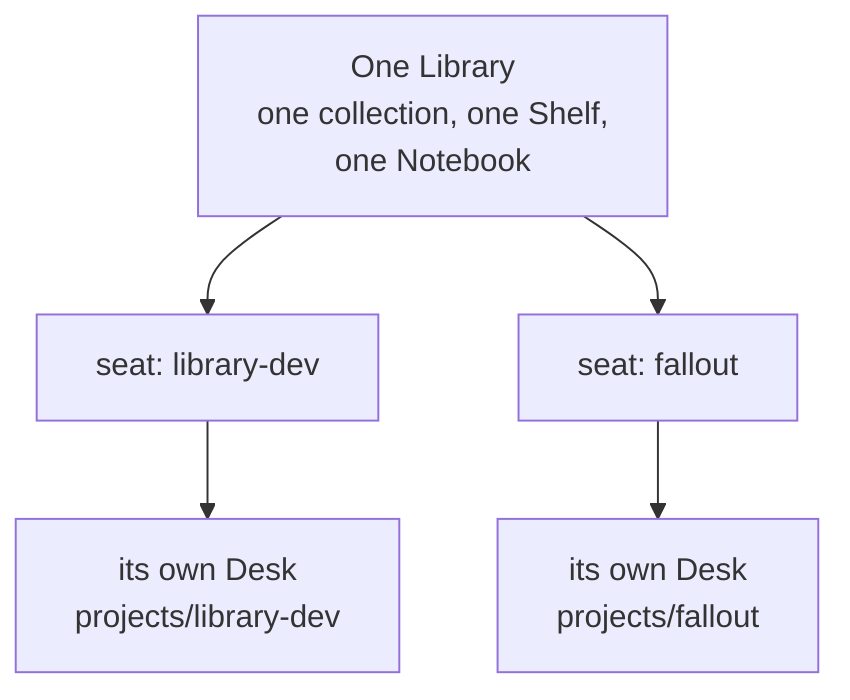

The binding holds in both directions and nothing undoes it: a seat cannot be re-aimed at another
Project, and a Project has at most one seat. Ask for a second seat instead — it costs nothing.

## Sitting down

**There is no default seat.** A session that is not sitting anywhere can read the Library's own
files and nothing else — it cannot open a Book, compile, reset, or edit a Project Hub. That is a
real state rather than a misconfiguration, because a default would be the seat that stray work
silently joined.

You do not have to remember any of this, because the session tells you:

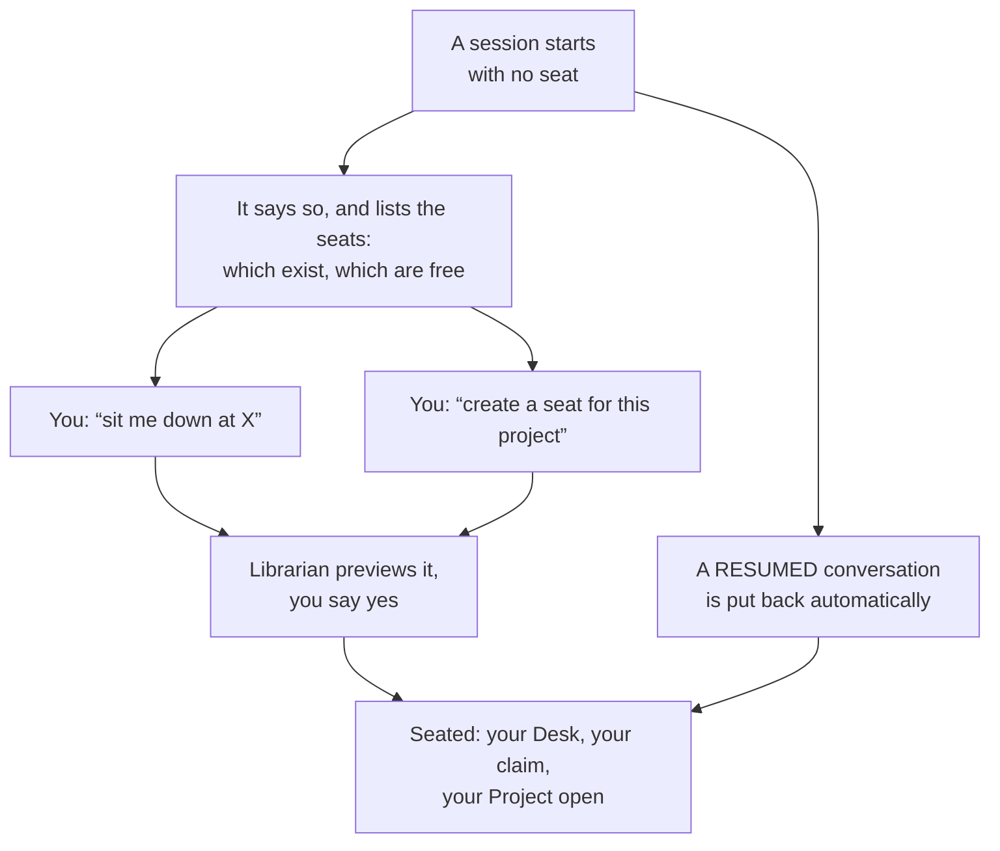

A resumed conversation returns to the seat it last held without asking, as long as nobody else is
sitting there. If the conversation cannot help — hooks off, a terminal outside Orca, a recovery —
the **Library Seat** button in the tab bar opens a picker that does the same job.

**Reads never need your claim; changes always do.** Listing what exists, browsing the catalogs, and
asking what survived a reset all work without one.

## Opening and closing

Books live in the shared collection or on the local Shelf. Project Hubs live only in the shared
collection. Either way, "open" and "close" mean the same thing: on the Desk, the Librarian can read
it; off the Desk, closed means **unavailable** — on the Shelf exactly as on the network, even though
the Shelf's files sit on this machine.

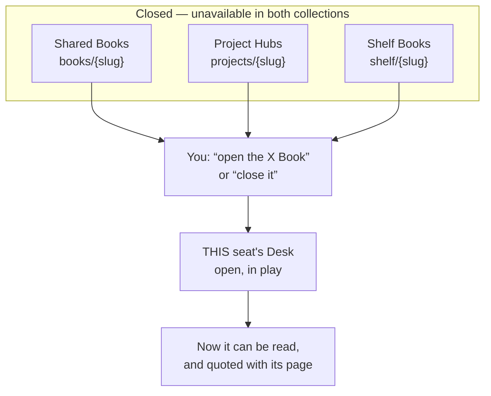

Opening and closing act on **your** Desk and need your seat. A closed Book is never quietly read
around the edge: the Librarian says it is closed and offers to open it.

## Into the Notebook, and straight back out again

The Notebook is volatile working knowledge. **Capture** is the move that needs no decision and no
open Book, and it is deliberately the cheapest path in the Library.

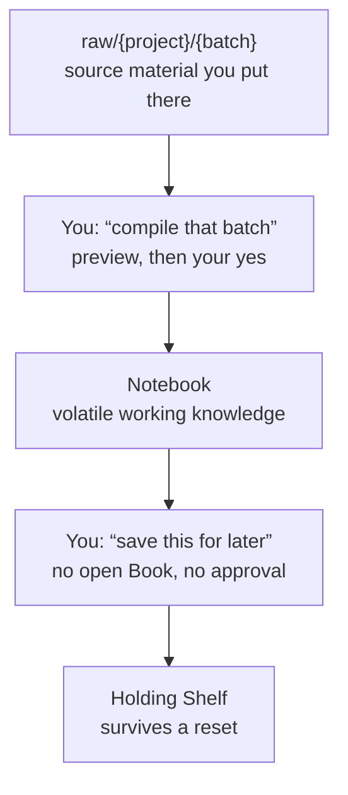

Putting files into `raw/<project>/<batch>/` is the one routine step you do with your own hands. If
the material is at a web address or in a git repository, ask instead — fetched material arrives with
a record of exactly what was fetched, so months later the Library can tell you whether it has fallen
behind its source.

## Graduating: the three durable exits

**Graduating** is moving something somewhere a reset cannot reach. All three need the destination
open on your Desk.

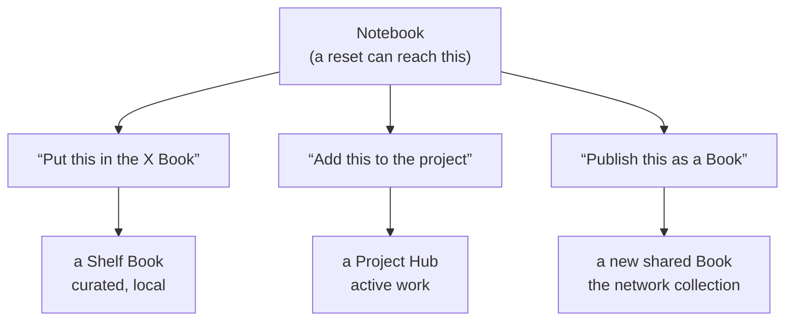

Before a reset, you can ask for a **triage pass** instead of moving things one at a time: the
Librarian proposes a destination for each piece of the Notebook and does the whole set on one
approval.

## What a reset moves, and how it comes back

A reset is **seat-scoped** and it **sets material aside rather than deleting it**. Nothing is
destroyed, and the way back is an ordinary request.

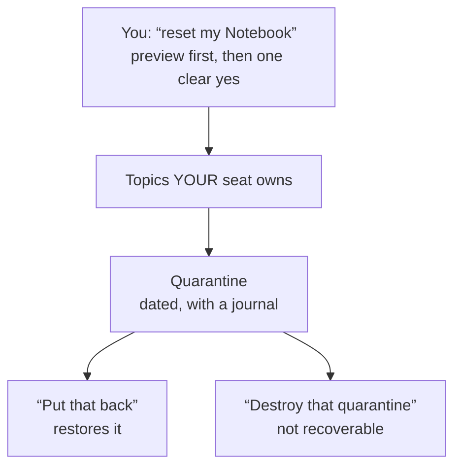

What it leaves alone is as important as what it takes:

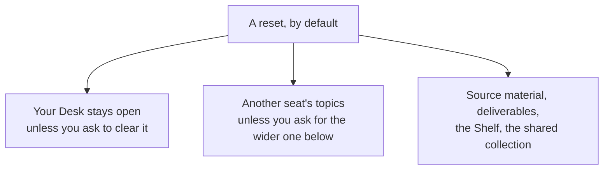

**An unowned topic stops a reset.** A topic no seat owns is not swept up on a guess — the refusal
names it and asks you to settle it. That is the design working.

## Clearing the whole Notebook, not just your slice

The Notebook is shared and the reset is not, so "clear my notebook" leaves behind every topic
belonging to another seat — and a search afterwards turns up none of your own. Ask for the wider one
when that is what you meant: **"clear every idle seat's topics too."**

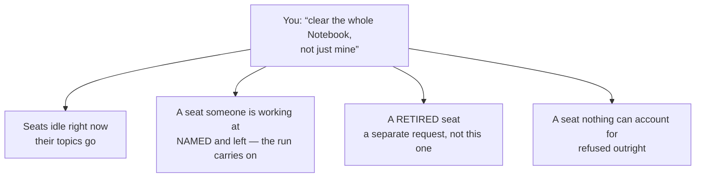

**Being skipped is not being refused.** A busy seat is named and left where it is, and the rest of
the run happens anyway. One person still working does not cancel "clear every idle seat".

**Idle and retired are two requests, deliberately.** The Library will not do both in one operation: a
seat that is merely quiet today is not a seat that is finished, and folding them together would let
the wider word quietly reach work nobody has said is done. Ask for the idle sweep first and the
retired-seat clear after — each shows its own preview and takes its own yes.

**The preview is where you check whose work you are about to move.** It names every topic the run
would take, **whose it is**, and how much of it already exists in a Book or a Project Hub — and every
topic it leaves, with the reason it was left. This is the one preview worth reading slowly, because
it is the only operation in the Library that moves somebody else's material.

**One sweep makes one quarantine, and its journal is the only thing that remembers whose each topic
was.** The material itself carries no owner, so that record is what lets a swept topic go back to the
seat it came from. Ask what is in a quarantine before you ever destroy one.

**"Empty" is not something a reset gives you, and it is worth knowing why before you ask.** Some
topics are **declared out of reach** — marked as shared ground, or deliberately protected — and no
reset of any width takes those. A topic can be left behind for four different reasons, and the
preview tells you which:

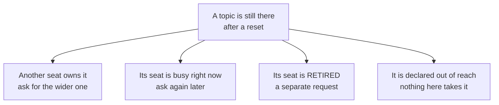

**The fourth one is not a wall to get around.** A topic is declared out of reach because something
would be lost if a reset took it — one in this Library is a published Book's **refresh source**, and
losing it would cost the ability to update that Book. You *can* change the declaration and then
reset, but that is a separate decision with its own consequence, so ask what the declaration is
protecting before undoing it. If the honest answer is "this should stay", then a Notebook that is
nearly empty is the correct outcome, not a failure.

**Ask for what will be left, not just what will go.** The preview is written around what the reset
would *take*. If your question is "will my Notebook be empty?", say so — the Librarian works the
leftovers out for you rather than leaving you to add up the lists.

## Capture and triage on the Holding Shelf

"Save this for later" needs no open Book and cannot lose anything, because it only ever adds a page.
Reading or sorting what landed there does need the Book open, like any Shelf page.

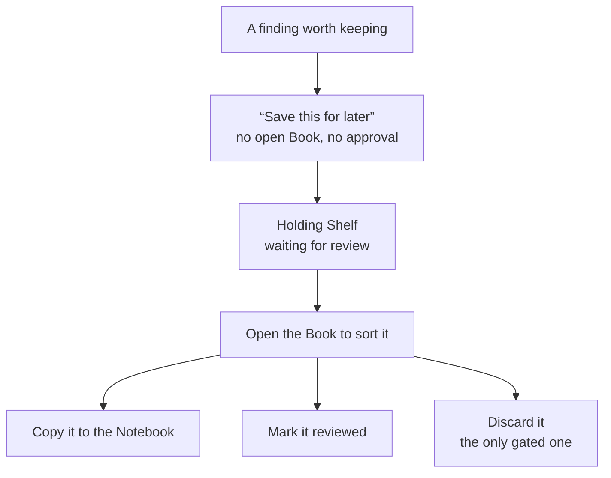

Copying to the Notebook **copies rather than moves**, so the Shelf record survives the next reset
even after you have worked on the copy. Only discarding is gated, because it is the only one of the
three that can lose something.

## The preview-and-approve pattern

Every consequential action in the Library — publishing, refreshing, triage, archiving, resetting,
retiring, restoring, discarding — has the same shape, so you only have to learn it once.

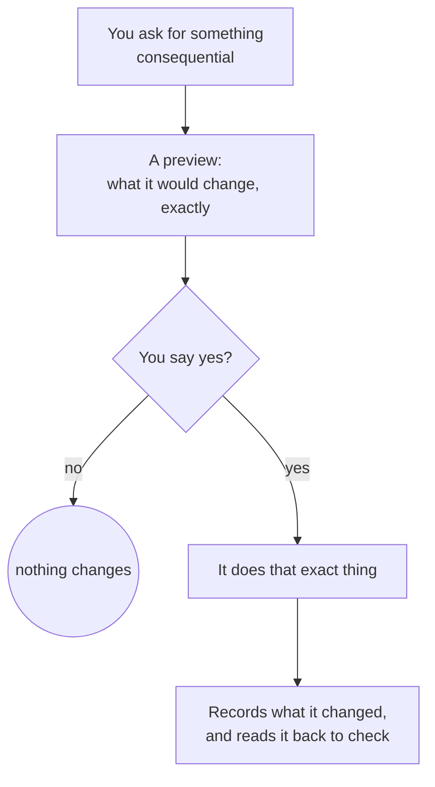

**Your yes covers that one previewed action and never carries to the next.** If anything changed
between the preview and your approval, the action stops with nothing written and shows you a fresh
preview — that is the guard working, not a glitch. And a preview that finds something it must refuse
does not offer you an approval at all.

## Answering a question, layer by layer

Search says where a term occurs; it never says what the material means. Opening what a hit names is
part of answering, not an optional extra.

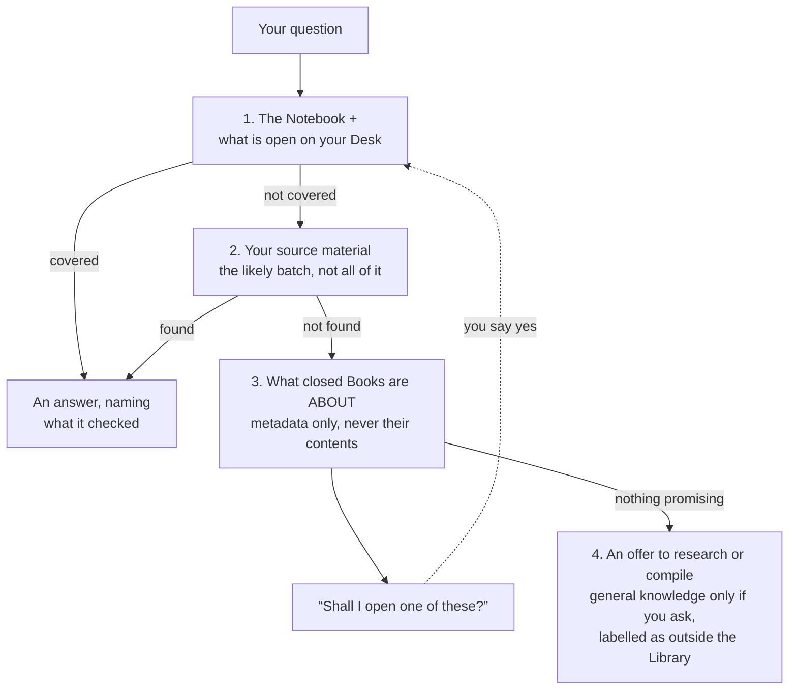

**An answer that stopped early is never a finding of absence**, and a dormant Book is never opened
just to search it — knowing what a Book is about only earns the suggestion to open it. When raw
material does answer something, the Librarian writes the finding into the Notebook as part of
answering, so the next question does not have to re-derive it.

## Key Takeaways

- One Library, one collection, one Shelf, one Notebook — and one Desk **per seat**. There is no
  default seat, and a session holding none can read the Library's own files and nothing else.
- You never have to remember where you are sitting: a seatless session says so and asks, and a
  resumed one puts you back.
- Reads never need your seat's claim; opening, compiling, resetting and triaging always do.
- Open and closed mean the same thing everywhere — on the Desk and readable, or off it and not —
  whether the Book lives on the Shelf or the network.
- A reset takes the topics **your seat owns** and sets them aside; it leaves your Desk open unless
  you ask otherwise, refuses a topic nobody owns, and has a supported way back.
- Saving something for later is free because it can only add. Everything that could lose something
  previews first and waits for one clear yes.
- Search and discovery say where a term occurs, never what it means — opening the hit is what
  licenses an answer.
